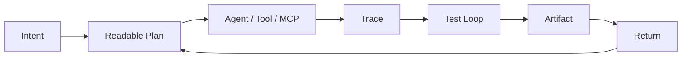

<!--
  xyls999 / Dovaklin profile README
  Theme: dark RPG command center, tabletop quest log, game-system UI
  Palette: void #0D1117, steel #214E68, cyan #7DCFFF, ember #F7768E, gold #F2B35D, parchment #F5F2E8
-->

<p align="center">
  
</p>

<p align="center">
  <a href="https://github.com/xyls999/xyls999"></a>
  <a href="https://github.com/xyls999?tab=repositories"></a>
  <a href="https://github.com/xyls999"></a>
  
</p>

<p align="center">
  <a href="https://git.io/typing-svg">
    
  </a>
</p>

<table>
  <tr>
    <td width="58%" valign="top">
      <h2>Character Sheet</h2>
      <table>
        <tr><td><b>Callsign</b></td><td>Dovaklin / xyls999</td></tr>
        <tr><td><b>Guild</b></td><td>HUHAi</td></tr>
        <tr><td><b>Spawn Point</b></td><td>China</td></tr>
        <tr><td><b>Class</b></td><td>AI Agent builder, system toolmaker, game-minded designer</td></tr>
        <tr><td><b>Main Quests</b></td><td>Agentic IM bots, controllable multi-agent workflows, MCP device control, OS/robotics labs, readable automation</td></tr>
        <tr><td><b>Core Rule</b></td><td>Build things that can be traced, replayed, tested, and returned to.</td></tr>
      </table>
    </td>
    <td width="42%" valign="top">
      <h2>Live Stats</h2>
      
    </td>
  </tr>
</table>

## Campaign Board

| Route | Current arc | Signals |
| --- | --- | --- |
| Agent Route | IM bots, tool calling, workflow control, source-backed skills | LangBot, WorkFlowX, A2-AgentLinux, lineage-skill |
| Device Route | MCP servers, HarmonyOS device control, robotics experiments | HarmonyOS-mcp-server, ROS car projects, robot-frie |
| System Route | Operating systems, Linux, shell workflows, old-code archaeology | hhuOS, old-code, shell scripts |
| App Route | Java/Spring, Vue, Python services, lab apps | zhize lab projects, news/web systems, WeChat pages |
| Profile Route | Self-updating GitHub profile, visual systems, reusable templates | BEPb reference, awesome-github-profile-readme reference |

## Arsenal

<p align="center">
  <a href="https://skillicons.dev">
    
  </a>
</p>

| Slot | Loadout |
| --- | --- |
| Languages / IDE |       |
| AI / Agent Systems |       |
| Systems / Platform |      |
| Data / Learning |      |

## Featured Quests

<p align="center">
  <a href="https://github.com/xyls999/A2-AgentLinux"></a>
  <a href="https://github.com/xyls999/roscar-first"></a>
  <a href="https://github.com/xyls999/cs-review"></a>
  <a href="https://github.com/xyls999/java-zhizelab-backend-xyls"></a>
</p>

## Reference Vault

| Relic | Why it stays in the build |
| --- | --- |
| [xyls999/xyls999](https://github.com/xyls999/xyls999) | The special profile repository that renders this README on the GitHub home page. |
| [xyls999/BEPb](https://github.com/xyls999/BEPb) | Preserved feature DNA: badges, typing SVG, stats, streak, snake, 3D calendar, metrics, trophy, counters, map, star history. |
| [xyls999/awesome-github-profile-readme](https://github.com/xyls999/awesome-github-profile-readme) | Inspiration library for profile categories, dynamic widgets, game-mode profiles, badges, icons, and automation. |
| [xyls999/WorkFlowX](https://github.com/xyls999/WorkFlowX) | A useful direction for controllable, traceable, token-aware multi-agent workflows. |
| [xyls999/HarmonyOS-mcp-server](https://github.com/xyls999/HarmonyOS-mcp-server) | Device-control spellbook for MCP and HarmonyOS experiments. |
| [xyls999/lineage-skill](https://github.com/xyls999/lineage-skill) | Source-backed skill distillation pattern for turning material into reusable agent abilities. |

## System Loop



## Activity Radar

<p align="center">
  
  
</p>

<p align="center">
  
</p>

## Contribution Arcade

<p align="center">
  <picture>
    <source media="(prefers-color-scheme: dark)" srcset="https://raw.githubusercontent.com/xyls999/xyls999/output/github-contribution-grid-snake-dark.svg" />
    <source media="(prefers-color-scheme: light)" srcset="https://raw.githubusercontent.com/xyls999/xyls999/output/github-contribution-grid-snake.svg" />
    
  </picture>
</p>

<p align="center">
  
</p>

## Trophies

<p align="center">
  <a href="https://github.com/ryo-ma/github-profile-trophy">
    
  </a>
</p>

## Metrics Console

<p align="center">
  
</p>

## World Map

```geojson
{
  "type": "FeatureCollection",
  "features": [
    {
      "type": "Feature",
      "properties": {
        "name": "China",
        "callsign": "xyls999 / Dovaklin"
      },
      "geometry": {
        "type": "Point",
        "coordinates": [104.1954, 35.8617]
      }
    }
  ]
}
```

## Visitor Ledger

<p align="center">
  
  <br />
  
</p>

## Star History

<p align="center">
  <a href="https://star-history.com/#xyls999/xyls999&Date">
    
  </a>
</p>

<details>
  <summary>Optional achievement slots from the BEPb-style profile</summary>

This build keeps the feature slots, but does not show broken third-party badges without your external account IDs. When you want them visible, add your usernames for TryHackMe, Kaggle, HackerRank, CodersRank, LinkedIn, Twitter/X, email, WhatsApp, or custom community links.

```md
<!-- TryHackMe -->


<!-- Kaggle -->


<!-- CodersRank -->


<!-- HackerRank local badge images -->

```

</details>

<p align="center">
  <a href="https://github.com/xyls999"></a>
  <a href="https://github.com/xyls999?tab=repositories"></a>
</p>

<p align="center">
  
</p>
