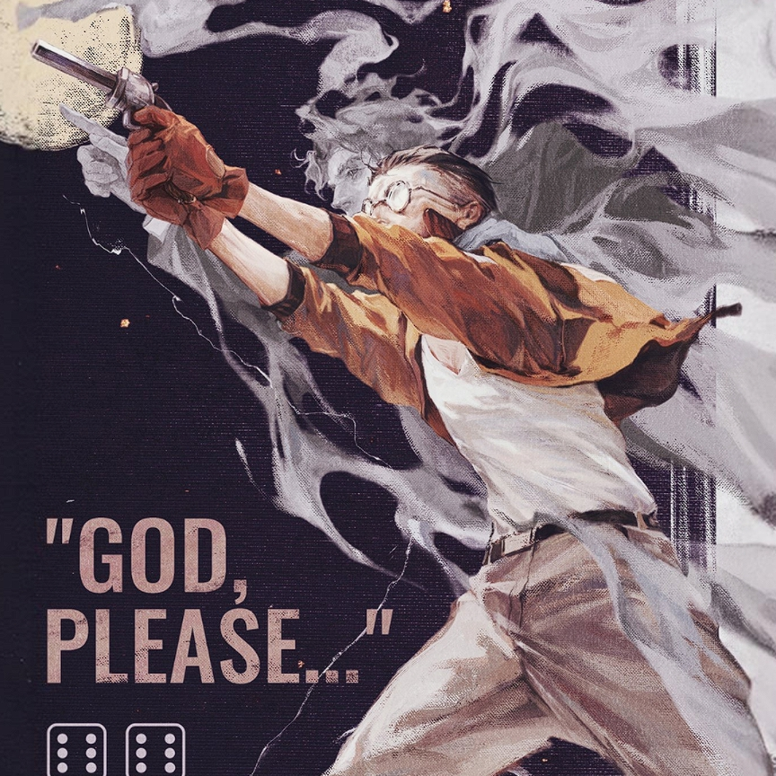
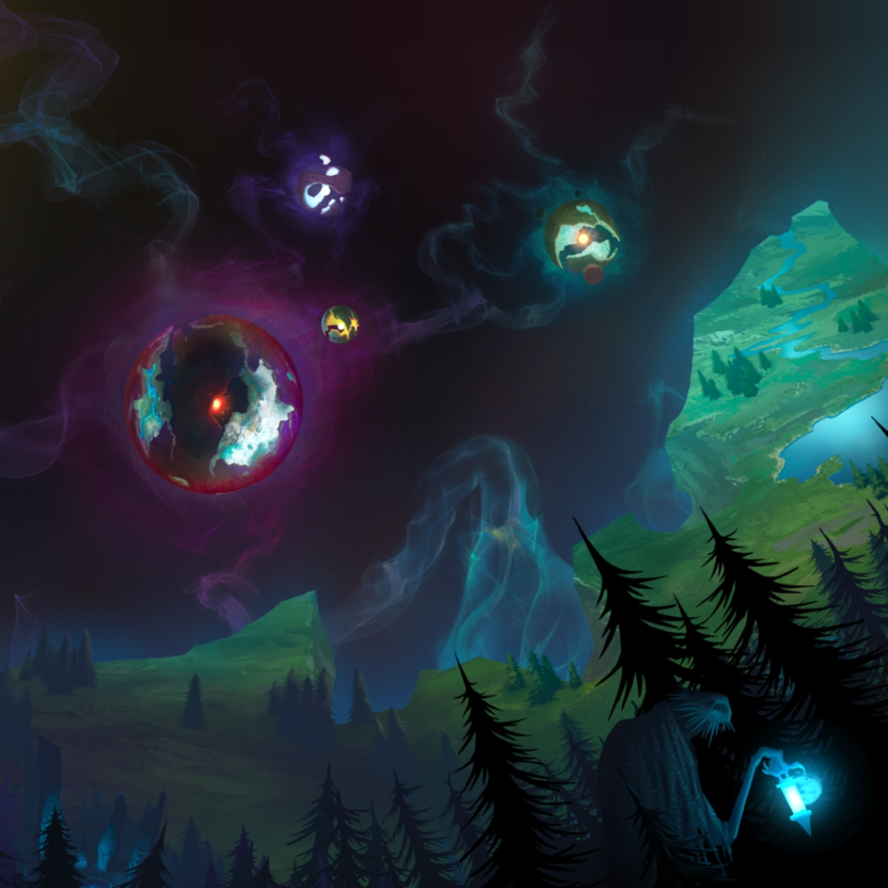

# xyls999 / Dovaklin

Student in **Big Data Management and Application**  
Software-oriented learner working across agents, full-stack systems, Linux, networks, security, deep learning, and reinforcement learning.

<table>
  <tr>
    <td width="46%" valign="top">
      <h2>Homepage</h2>
      

        This profile is my public notebook for software practice, technical
        experiments, and long-term learning. I use it to keep project outcomes,
        references, implementation notes, and ideas that are worth revisiting.
      

      

        I welcome builders from different backgrounds to exchange technical
        views, learning methods, and practical experience. Good engineering is
        rarely a solo path.
      

    </td>
    <td width="54%" valign="top">
      
    </td>
  </tr>
</table>

<table>
  <tr>
    <td width="60%" valign="top">
      
    </td>
    <td width="40%" valign="top">
      <h2>Profile</h2>
      

        I mainly study software engineering, while staying curious about computer
        science and related fields that connect code to real environments:
        devices, data, networks, systems, models, and human workflows.
      

      

        The profile is organized as a working record rather than a resume wall:
        each section connects a technical direction with projects, notes, or
        visual context.
      

    </td>
  </tr>
</table>

<table>
  <tr>
    <td><b>Base</b></td>
    <td>Big Data Management and Application</td>
    <td><b>Main line</b></td>
    <td>Agent engineering and full-stack systems</td>
  </tr>
  <tr>
    <td><b>Systems</b></td>
    <td>Linux, operating systems, networks, security</td>
    <td><b>AI track</b></td>
    <td>Deep learning, reinforcement learning, robotics</td>
  </tr>
</table>

## Laboratory

<table>
  <tr>
    <td width="42%" valign="top">
      
    </td>
    <td width="58%" valign="top">
      
    </td>
  </tr>
  <tr>
    <td width="42%" valign="top">
      <h3>Hehai University Zhize Laboratory</h3>
      

        I am part of Zhize Laboratory at Hehai University, a mostly
        undergraduate laboratory shaped around technical practice, project
        exploration, and innovation-oriented learning.
      

      

        The lab setting pushes me to treat projects as more than coursework:
        read the system, build a prototype, test the idea, record the process,
        and make the next attempt clearer.
      

    </td>
    <td width="58%" valign="top">
      

        The laboratory context gives my work a practical bias: software should be
        tested, documented, discussed, and improved through repeated attempts.
      

    </td>
  </tr>
</table>

## Technical Tracks

<table>
  <tr>
    <td width="42%" valign="top">
      <table>
        <tr><td><b>Agent engineering</b></td><td>MCP, tool calling, workflow control, agent-side automation.</td></tr>
        <tr><td><b>Full stack</b></td><td>Java / Spring services, Vue interfaces, APIs, data access, deployment notes.</td></tr>
        <tr><td><b>Systems</b></td><td>Linux practice, OS reading, network configuration, security labs.</td></tr>
        <tr><td><b>Learning systems</b></td><td>Deep learning inference, reinforcement learning, robotics, model deployment.</td></tr>
      </table>
    </td>
    <td width="58%" valign="top">
      
    </td>
  </tr>
</table>

## Selected Repositories

| Repository | Area | What it is for |
| --- | --- | --- |
| [WorkFlowX](https://github.com/xyls999/WorkFlowX) | Agent workflow | Multi-agent workflow, controllability, traceability, and token efficiency. |
| [A2-AgentLinux](https://github.com/xyls999/A2-AgentLinux) | Agent + Linux | Agent-side experiments around Linux environments and system operations. |
| [HarmonyOS-mcp-server](https://github.com/xyls999/HarmonyOS-mcp-server) | MCP + device | MCP server experiments for manipulating HarmonyOS NEXT devices. |
| [A9-harmony-front-device](https://github.com/xyls999/A9-harmony-front-device) | Device control | Front-device experiments around HarmonyOS and automation. |
| [java-zhizelab-backend-xyls](https://github.com/xyls999/java-zhizelab-backend-xyls) | Backend | Java backend API and service structure practice. |
| [web-zhizelabwithbackend-xyls](https://github.com/xyls999/web-zhizelabwithbackend-xyls) | Frontend | Frontend and backend integration practice. |
| [roscar-first](https://github.com/xyls999/roscar-first) | Robotics | ROS car project practice and device-side integration. |
| [cs-review](https://github.com/xyls999/cs-review) | CS basics | Operating systems, networks, Java, and computer science review notes. |

<table>
  <tr>
    <td width="50%" valign="top">
      
    </td>
    <td width="50%" valign="top">
      <h3>Why These Notes Exist</h3>
      

        I do not want repositories to be only file storage. A useful repository
        should show the problem, the path taken, the result, and the next thing
        to improve.
      

      

        This is why my profile mixes project links with visual markers: each
        section should feel like a part of a learning record, not a standalone
        gallery.
      

    </td>
  </tr>
  <tr>
    <td width="50%" valign="top">
      <h3>Learning Attitude</h3>
      

        I am especially focused on software direction, but I keep an open
        interest in adjacent computer-related areas. Operating systems, networks,
        model deployment, security practice, and robotics often meet in the same
        project sooner than expected.
      

    </td>
    <td width="50%" valign="top">
      
    </td>
  </tr>
</table>

## Stack

<table>
  <tr>
    <td width="62%" valign="top">
      
    </td>
    <td width="38%" valign="top">
      <b>Daily use</b>
        
      
      
      
      
      
      
        
      <b>Systems and AI</b>
        
      
      
      
      
      
      
      
      
    </td>
  </tr>
</table>

<table>
  <tr>
    <td width="42%" valign="top">
      <h3>Current Goal</h3>
      

        Make selected repositories easier to read, reproduce, and evaluate:
        clearer README files, better setup notes, smaller verified examples, and
        more honest records of what works.
      

    </td>
    <td width="58%" valign="top">
      
    </td>
  </tr>
</table>

## GitHub Activity

More stats

Contribution graph

<picture>
  <source media="(prefers-color-scheme: dark)" srcset="https://raw.githubusercontent.com/xyls999/xyls999/output/github-contribution-grid-snake-dark.svg" />
  <source media="(prefers-color-scheme: light)" srcset="https://raw.githubusercontent.com/xyls999/xyls999/output/github-contribution-grid-snake.svg" />
  
</picture>

3D Contribution

## Reference

Layout direction inspired by [abhisheknaiidu/awesome-github-profile-readme](https://github.com/abhisheknaiidu/awesome-github-profile-readme), especially `Descriptive`, `Simple but Innovative Ones`, `GIFS`, `Dynamic Realtime`, and `Just Images`: clear information first, real media second, and GitHub-safe motion only.
