<!--
  xyls999 / Dovaklin profile README
  Stable RPG portfolio build: local SVG first, external widgets only where they are reliable.
-->

  

  
   
  

  

<table>
  <tr>
    <td width="50%" valign="top">
      <h2>Character Sheet</h2>
      <table>
        <tr><td><b>Callsign</b></td><td>Dovaklin / xyls999</td></tr>
        <tr><td><b>Guild</b></td><td>HUHAi</td></tr>
        <tr><td><b>Spawn Point</b></td><td>China</td></tr>
        <tr><td><b>Class</b></td><td>AI Agent builder, system toolmaker, game-minded designer</td></tr>
        <tr><td><b>Core Rule</b></td><td>Trace it, test it, return to it.</td></tr>
      </table>
    </td>
    <td width="50%" valign="top">
      <h2>Current Build</h2>
      <ul>
        <li>Agentic IM bots and workflow control</li>
        <li>MCP device control and HarmonyOS experiments</li>
        <li>ROS / robotics labs and small systems</li>
        <li>Java, Vue, Python, Spring, Linux, automation</li>
      </ul>
    </td>
  </tr>
</table>

  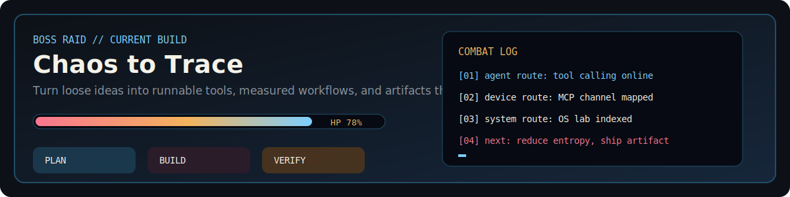

## Activity Dashboard

  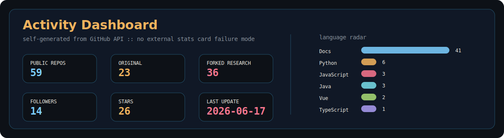

## Project Compendium

  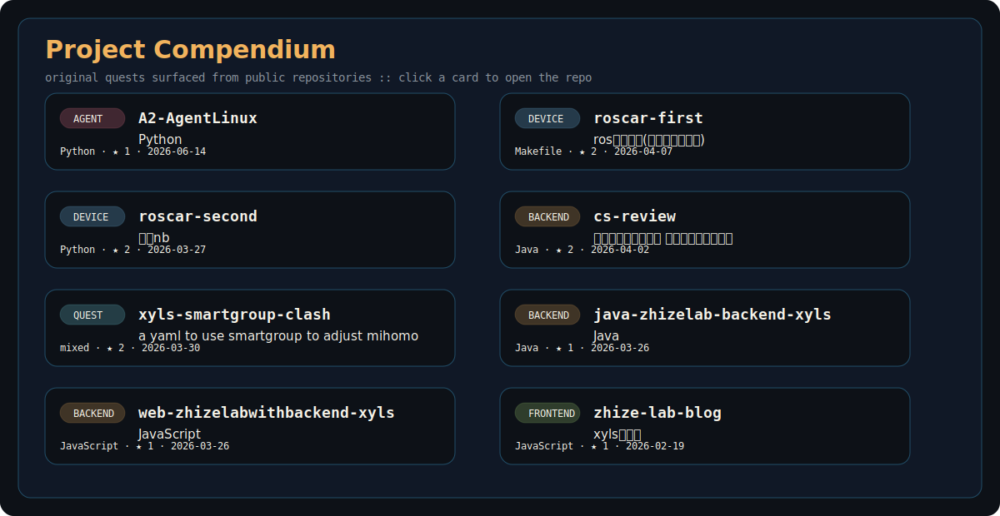

## Research Radar

  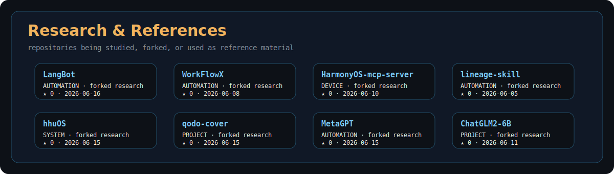

## Arsenal

  

| Slot | Loadout |
| --- | --- |
| Languages / IDE |       |
| AI / Agent Systems |       |
| Systems / Platform |      |
| Data / Learning |      |

## Quest Map

  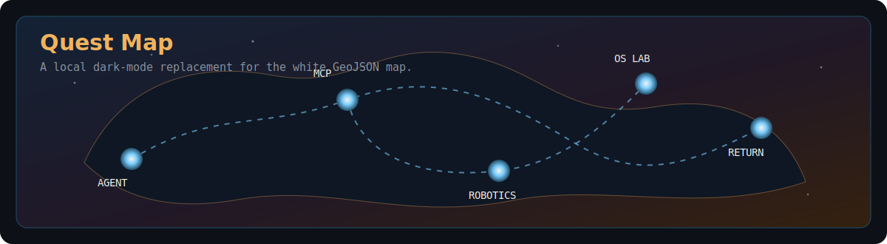

## System Loop

  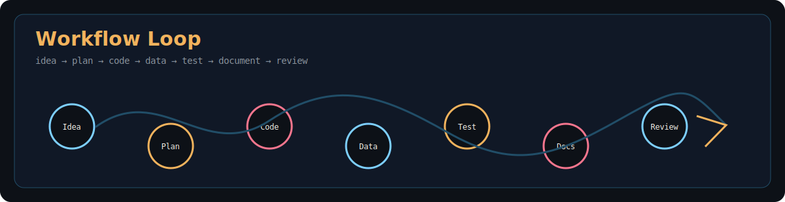

## Contribution Arcade

  <picture>
    <source media="(prefers-color-scheme: dark)" srcset="https://raw.githubusercontent.com/xyls999/xyls999/output/github-contribution-grid-snake-dark.svg" />
    <source media="(prefers-color-scheme: light)" srcset="https://raw.githubusercontent.com/xyls999/xyls999/output/github-contribution-grid-snake.svg" />
    
  </picture>

  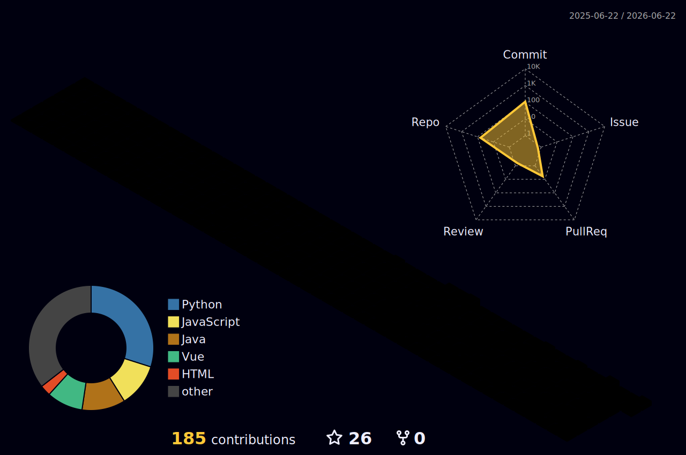

## Metrics Console

  
Full generated metrics

  

## Reference Vault

| Relic | Why it stays in the build |
| --- | --- |
| [xyls999/BEPb](https://github.com/xyls999/BEPb) | Feature DNA: badges, typing SVG, stats, snake, 3D calendar, metrics, counters, maps, star history. |
| [xyls999/awesome-github-profile-readme](https://github.com/xyls999/awesome-github-profile-readme) | Inspiration library for profile categories, dynamic widgets, game-mode profiles, badges, icons, and automation. |
| [xyls999/WorkFlowX](https://github.com/xyls999/WorkFlowX) | Controllable, traceable, token-aware multi-agent workflow reference. |
| [xyls999/HarmonyOS-mcp-server](https://github.com/xyls999/HarmonyOS-mcp-server) | Device-control spellbook for MCP and HarmonyOS experiments. |
| [xyls999/lineage-skill](https://github.com/xyls999/lineage-skill) | Source-backed skill distillation pattern. |

## Visitor Ledger

  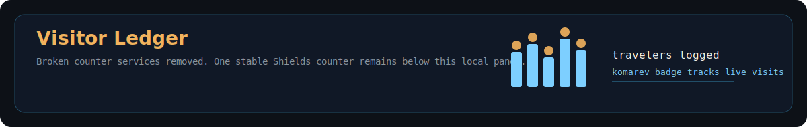
   
  

  
  

  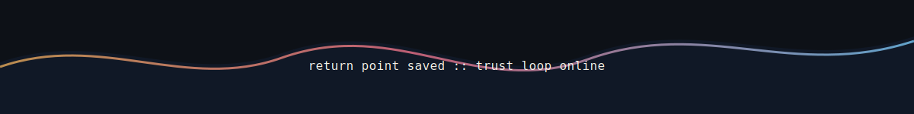

