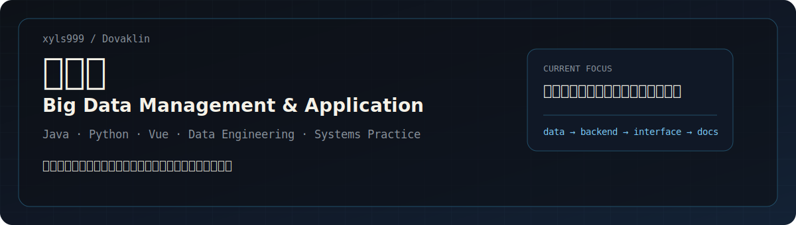
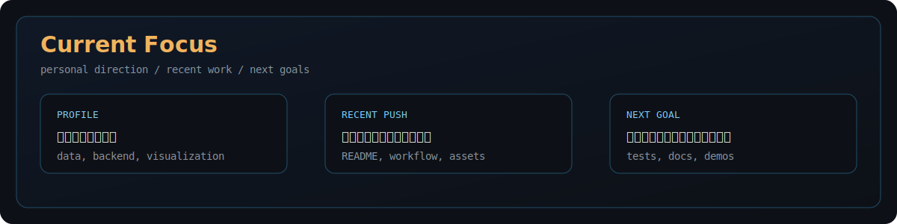
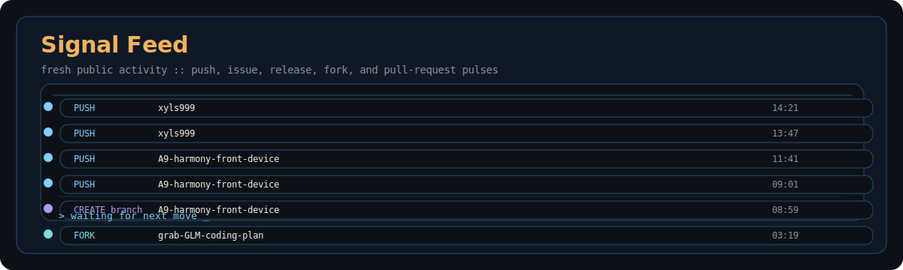

<!--
  xyls999 profile README
  Focus: personal information, recent activity, goals, projects, and reliable local assets.
-->

  

  
   
  

  

## About

<table>
  <tr>
    <td width="50%" valign="top">
      <h3>Profile</h3>
      <table>
        <tr><td><b>Name</b></td><td>刘鸿宇 / xyls999</td></tr>
        <tr><td><b>Major</b></td><td>大数据管理与应用</td></tr>
        <tr><td><b>Location</b></td><td>China</td></tr>
        <tr><td><b>Focus</b></td><td>数据管理、后端开发、自动化工具、可视化页面</td></tr>
      </table>
    </td>
    <td width="50%" valign="top">
      <h3>Now</h3>
      <ul>
        <li>整理课程、实验和项目代码，让仓库更清晰可复用</li>
        <li>练习 Java / Spring、Python、Vue 和数据处理流程</li>
        <li>维护 GitHub Profile、Actions 自动更新和项目展示</li>
        <li>把想法落到可运行 demo、文档和提交记录里</li>
      </ul>
    </td>
  </tr>
</table>

  

## Recent Pushes

  

## Goals

| Area | Goal |
| --- | --- |
| 学习 | 建立大数据管理与应用方向的知识索引，持续整理课程笔记和项目复盘 |
| 工程 | 把 Java / Python / Vue 项目做成结构清楚、能运行、能展示的作品 |
| 数据 | 练习数据采集、清洗、存储、分析和可视化的完整流程 |
| 自动化 | 用 GitHub Actions 和脚本减少重复操作，保持页面与仓库自动更新 |

## Activity Overview

  

## Projects

  

## Research & References

  

## Skills

  

| Category | Tools |
| --- | --- |
| Languages |     |
| Frontend / Backend |     |
| Data / Tools |      |

## Contribution

  <picture>
    <source media="(prefers-color-scheme: dark)" srcset="https://raw.githubusercontent.com/xyls999/xyls999/output/github-contribution-grid-snake-dark.svg" />
    <source media="(prefers-color-scheme: light)" srcset="https://raw.githubusercontent.com/xyls999/xyls999/output/github-contribution-grid-snake.svg" />
    
  </picture>

  

## Metrics

  
Generated metrics

  

## Links

| Link | Note |
| --- | --- |
| [xyls999/BEPb](https://github.com/xyls999/BEPb) | 参考过的 Profile 功能集合 |
| [xyls999/awesome-github-profile-readme](https://github.com/xyls999/awesome-github-profile-readme) | Profile README 资料库 |
| [xyls999/WorkFlowX](https://github.com/xyls999/WorkFlowX) | 工作流与自动化相关项目 |
| [xyls999/HarmonyOS-mcp-server](https://github.com/xyls999/HarmonyOS-mcp-server) | 设备控制相关实验 |

  

  
  

